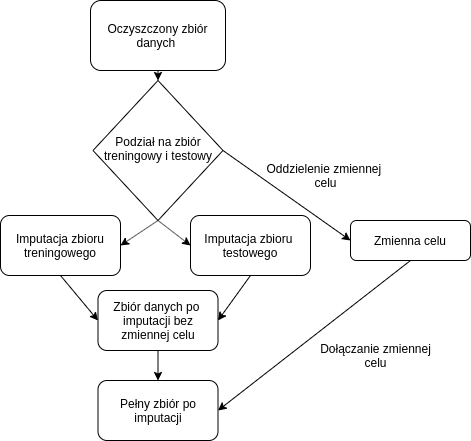

```{r setup, include=FALSE}
knitr::opts_chunk$set(echo = FALSE)
```

## Wykorzystane zbiory danych  

```{r echo=FALSE, message=FALSE, warning=FALSE,cache=TRUE}
path_to_datasets <- "/home/jan/Pulpit/WB/2020L-WarsztatyBadawcze-Imputacja/datasets/"
#path_to_datasets <- "/home/piotr/Programowanie/WB/fork_grupy/2020L-WarsztatyBadawcze-Imputacja/datasets"
#path_to_datasets <- "/home/arctickey/2020L-WarsztatyBadawcze-Imputacja/datasets"

folder <- list.dirs(path_to_datasets)
folder <- folder[-1]
script_paths <- paste(folder, '/', 'code.R', sep='')

zbiory_danych <- as.data.frame(matrix(nrow = 14,ncol = 5))
colnames(zbiory_danych) <- c('Ilość Obserwacji','Ilość Kolumn','Procent braków danych','Balans Klas','Openml_ID')
iterator <- 1 
for(i in script_paths){
  source(i, chdir=T)
  zbiory_danych[iterator,2] <- paste0(length(colnames(dataset))-1,' ')
  zbiory_danych[iterator,1] <- paste0(length(dataset[,1]),' ')
  more_frequent  <- table(dataset[,target_column])[1]
  less_frequent <- table(dataset[,target_column])[2]
  suma <- more_frequent+less_frequent
  balans <- paste0(round(more_frequent/suma*100,2),'%/',round(less_frequent/suma*100,2),'%')
  zbiory_danych[iterator,4] <- balans
  number_of_missing <- sum(sapply(dataset, function(x) sum(is.na(x))))
  
  zbiory_danych[iterator,3] <- paste0(round(number_of_missing/(length(dataset[,1])*(length(colnames(dataset))-1)),2),'%')
  zbiory_danych[iterator,5] <- openml_id
  iterator <- iterator+1
}

knitr::kable(zbiory_danych, format = "html", table.attr = "style='height:40%;'")
```
## Podział zbirou na testowy i treningowy 
Karzdy zbiór był wstępnie czyszczony a następnie dzielony w sposób losowy na podzbiór treningowy i testowy : 

- Zbiór terningowy **80%**obserwacji 
- Zbiór testwoy **20%** obserwacji

Podział pozostawał taki sam dla wszystkich metod imputacij i użytych modeli.

## Wykorzystane techniki imputacij braków danych 
Przed przystąpieniem do imputacij usuneliśmy zmienną celu:

- Imputacja z pomocą **mediany** (14/14)
- Imputacja metodą z pakietu **mice**(13/14)
- Imputacja **missForest** (?/14)
- Imputacja **missMDA** (11/14)
- Imputacja **softImpute + mediana** (12/14)
- Imputacja funkcją **irmi** z pakietu **VIM** (?????) Jescze nie przeprowadzona 

Po imputacij do zbioru ponownie dołączono kolumnę celu.

## Przebieg imputacij 

<center>



## Kodowanie zmiennych kategorycznych

Uzupełnione zbiory danych zawierają wiele zmiennych kategorycznych. Podejścia odrzucone:

- one-hot encoding
- ordinal encoding

Wybrane rozwiązanie:

- target encoding

Metoda kodowania jest uniwersalna i powszechnie używana.  
Dodatkowo usunięto w kilku zbiorach zmienne, które zawierały
bardzo dużo unikalnych wartości.

## Schemat kodowania zmiennych kategorycznych

- Zbiór podzielony na część treningową i testową
- Wyliczenie parametrów **target encoding** na zbiorze treningowym
- Kodowanie zmiennych w obu zbiorach

## Narzędzie do kodowania

Pakiet [H<sub>2</sub>O](https://docs.h2o.ai/h2o/latest-stable/h2o-docs/index.html) napisany w języku Java, udostępniający API
dla R i python. Wykorzystuje obliczenia wielowątkowe. Kompletne narzędzie do
uczenia maszynowego.  
Użyty moduł do target encoding:  

- dodanie szumu 
- średnie ważone względem liczności grup


## Wybrane algorytmy

Zbiory danych są gotowe do użycia przez modele uczenia maszynowego.  
Wykorzystane modele (*mlr name*):

- **regresja logistyczna**: *classif.glmnet*
- **las losowy**: *classif.ranger*
- **SVM**: *classif.svm*
- **XGBoost**: *classif.xgboost*

## Ewaluacja modeli

<center>

</center>


## Wyniki
Zdecydowaliśmy się na użycie dwóch miar skuteczności algorytmów: F1 score oraz Accuracy. Te dwie miary dobrze się uzupełniają, gdyż pozwalają dobrze zmierzyć skuteczności naszych imputacji oraz algorytmów zarówno na zbiorach zbalansowanych, jak i niezbalansowanych.

## Rozkład miary F1

```{r echo=FALSE, message=FALSE,warning=FALSE}
library(ggplot2)
library(tidyverse)
data <- read_csv('./wyniki_csv/RESULT.csv')
p<-ggplot(data, aes(x=method, y=F1, color=method)) +
  geom_boxplot()+theme_minimal()+labs(x="",y="")+ggtitle("Wyniki średnie F1")
p

```

## Odchylenie standardowe F1

```{r echo=FALSE, message=FALSE,warning=FALSE}
knitr::kable(data %>% group_by(method) %>% summarise(F1_std=sd(F1,na.rm=TRUE)))
```

## Rozkład miary Accuracy

```{r echo=FALSE, message=FALSE,warning=FALSE}


p1<-ggplot(data, aes(x=method, y=acc, color=method)) +
  geom_boxplot()+theme_minimal()+labs(x="",y="")+ggtitle("Wyniki średnie accuracy")

p1
```

## Odchylenie standardowe Accuracy

```{r echo=FALSE, message=FALSE,warning=FALSE}
knitr::kable(data %>% group_by(method) %>% summarise(acc_std=sd(acc,na.rm=TRUE)))
```

## 

Na podstawie tych wykresów można wnioskować o ogólnych wynikach, jednkaże nie można się nimi sugerować zbyt bardzo, gdyż wyniki uzyskane przez algorytmy rożnią się w zależności od trudności zbioru a także od użytego algorytmu uczenia maszynowego. Sprawdźmy więc jak wyniki F1 różnią się w zależności od rodzaju imputacji oraz użytego algorytmu.


##

```{r echo=FALSE, message=FALSE,warning=FALSE}
data1 <- data %>% group_by(method,algorithm) %>% summarise(F1_mean=mean(F1,na.rm=TRUE))


p2<-ggplot(data1, aes(x=method, y=F1_mean, color=algorithm)) +
  geom_boxplot()+theme_minimal()+labs(x="",y="")+ggtitle("Wyniki F1 pośród róznych algorytmów oraz imputacji")
p2

```


## Ranking metod

Jako bardziej wiarygodną próbę oceny skuteczności imputacji spróbujmy uszeregować je wedle następującego schematu. Weźmy wynik każdej z metod imputacji na każdym ze zbiorów. Wynik taki definiujemy jako średnia ze wszystkich algorytmów uczenia maszynowego puszczonych na danym zbiorze przy danej imputacji. Następnie sortujemy wynik od najwyższego i przyznajemy algorytmom punkty za każde miejsce. Końcowo punkty sumujemy a ta metoda imputacji, która punktów uzyska najmniej wygrwa nasz ranking.


##

```{r echo=FALSE, message=FALSE,warning=FALSE}
data[is.na(data)] <- 0
data3 <- data %>% group_by(dataset,method) %>% summarise(mean=mean(acc,na.rm=TRUE))
order_scores <- data3 %>% group_by(dataset) %>% mutate(good_ranks = order(order(mean, decreasing=TRUE)))
order_scores1 <- order_scores %>% group_by(method) %>% summarise(wynik = sum(good_ranks))
order_scores1
```


